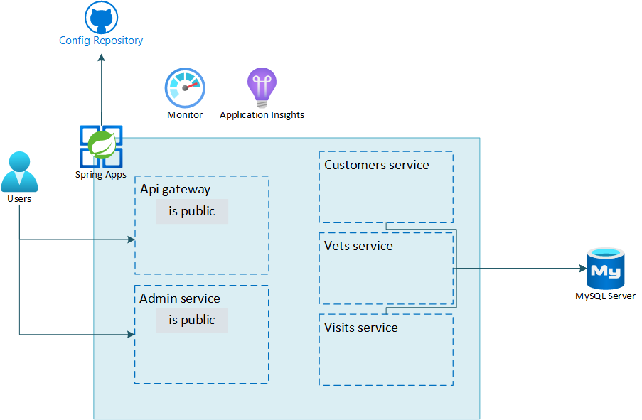

---
lab:
    Title: 'Challenge 03: Enable monitoring and end-to-end tracing'
    Learn module: 'Learn Module 3: Enable monitoring and end-to-end tracing'
---

# Challenge 03: Enable monitoring and end-to-end tracing

# Student manual

## Challenge scenario

You have created your first Spring Apps service, installed your microservices as apps and exposed them through the `api-gateway`. Now that everything is up and running, it would be helpful to be able to monitor the availability of your apps and detect any errors or exceptions that might occur during their usage. In this lab, you will implement their end-to-end monitoring.

## Objectives

After you complete this challenge, you will be able to:

- Live stream the logs from your apps
- Configure Application Insights to receive monitoring information from your apps
- Analyze app-specific monitoring data
- Configure diagnostics settings
- Analyze logs

The below image illustrates the end state you will be building in this challenge.



## Lab Duration

- **Estimated Time**: 60 minutes

## Instructions

In this challenge, you will:

- Live stream the logs from your apps
- Configure Application Insights to receive monitoring information from your apps
- Analyze app-specific monitoring data
- Configure diagnostics settings
- Analyze logs

> **Note**: The instructions provided in this exercise assume that you successfully completed the previous exercise and are using the same lab environment, including your Git Bash session with the relevant environment variables already set.

### Live stream the logs from your apps

As the initial mechanism for debugging any errors that may occur in your apps, Spring Apps Service provides the ability to live stream app logs. Use this method to live stream the logs of the api-gateway and the visits services. You can use the following guidance to perform this task:

- [Stream Azure Spring Apps application logs in real-time](https://learn.microsoft.com/azure/spring-apps/how-to-log-streaming?tabs=azure-CLI).

<details>
<summary>hint</summary>
<br/>

1. From the Git Bash prompt, run the following command to live stream the logs of the `customers-service` app, you can use the below statement:

   ```bash
   az spring app logs \
       --name customers-service \
       --resource-group $RESOURCE_GROUP \
       --service $SPRING_APPS_SERVICE \
       --follow
   ```

1. Switch to the web browser displaying the Spring Petclinic application and navigate through its interface. Note that your actions trigger display of new log entries in the console output.

1. Switch back to the Git Bash prompt and press `Ctrl+C` to stop streaming the logs.

</details>

### Configure Application Insights to receive monitoring information from your apps

You now know how to live stream any logs to your console. Next, you will configure Application Insights for your apps. Spring Apps Service uses an in-process Java Agent for Application Insights. When you first created your service, an Application Insights resource also got created for you by default. Double check whether this Application Insights instance is properly linked to your Spring Apps Service. If it is not, re-link Application Insights. You can use the following guidance to perform this task:

- [Use Application Insights Java In-Process Agent in Azure Spring Apps](https://learn.microsoft.com/azure/spring-apps/how-to-application-insights?pivots=sc-enterprise).

<details>
<summary>hint</summary>
<br/>

1. Run the following command to allow automatic installation of the Azure CLI extension required for this lab.

   ```bash
   az config set extension.use_dynamic_install=yes_without_prompt
   ```

1. Run the following command to check whether Application Insights is linked to your Spring Apps Service.

   ```bash
   az spring build-service builder buildpack-binding show --name default
   ```

   > **Note**: This should generate an output that resembles the following content:

   ```json
   {
     "id": "/subscriptions/xxxx/resourceGroups/rg-petclinic-592faa/providers/Microsoft.AppPlatform/Spring/sa-vnet-petclinic-592faa/buildServices/default/builders/default/buildpackBindings/default",
     "name": "default",
     "properties": {
       "bindingType": "ApplicationInsights",
       "launchProperties": {
         "properties": {
           "connection-string": "InstrumentationKey=xxxx;IngestionEndpoint=https://northeurope-5.in.applicationinsights.azure.com/;LiveEndpoint=https://northeurope. livediagnostics.monitor.azure.com/",
           "sampling-percentage": "10"
         },
         "secrets": null
       },
       "provisioningState": "Succeeded"
     },
     "resourceGroup": "rg-petclinic-592faa",
     "systemData": {
       "createdAt": "2023-06-28T07:57:36.474785+00:00",
       "createdBy": "xxxx",
       "createdByType": "User",
       "lastModifiedAt": "2023-06-28T07:57:36.474785+00:00",
       "lastModifiedBy": "xxxx",
       "lastModifiedByType": "User"
     },
     "type": "Microsoft.AppPlatform/Spring/buildServices/builders/buildpackBindings"
   }
   ```

   > **Note**: This output indicates that Application Insights is enabled and that your apps are sending monitoring data to Application Insights. In case you see different output, where there is no instrumentation key, you will need to reconfigure Application Insights. In that case follow the next steps.

1. To re-enable Application Insights, you will first need to retrieve the instrumentation key of your Application Insights instance.

   ```bash
   INSTRUMENTATIONKEY=$(az monitor app-insights component show \
       -g $RESOURCE_GROUP \
       --query [0].connectionString \
       -o tsv)
   ```

1. You can now use this instrumentation key to reconfigure Application Insights for your Spring Apps Service.

   ```bash
   az spring build-service builder buildpack-binding set \
       --name default \
       --builder-name default \
       --type ApplicationInsights \
       --properties sampling-percentage=10 \
                    connection-string=$INSTRUMENTATIONKEY
   ```

1. To validate the outcome, re-run the `az spring build-service builder buildpack-binding show` command and verify that it generates the intended output.

   ```bash
   az spring build-service builder buildpack-binding show --name default
   ```

</details>

### Analyze app-specific monitoring data

Now that Application Insights is properly configured, you can use it to monitor your apps. You can use the following guidance to perform this task:

- [Use Application Insights Java In-Process Agent in Azure Spring Apps](https://learn.microsoft.com/azure/spring-apps/how-to-application-insights?WT.mc_id=java-13165-sakriema&pivots=sc-enterprise).

Use this guidance to review such Application Insights features as:

- The Application Map
- Performance data
- Failures
- Metrics
- Live Metrics
- Availability
- Logs

<details>
<summary>hint</summary>
<br/>

1. In your browser, in the Azure Portal, navigate to the page displaying the resource group containing the Spring Apps service resources.

1. Select the Application Insights resource in the resource group. Note that the overview page displays data about Failed requests, Server response time, Server requests and Availability.

1. In the navigation menu, in the **Investigate** section, select **Application map**. This will display information about the apps running in your Spring Apps Service and their dependencies.

1. In the application map, select the circle representing the `api-gateway` service. This will display details about this app, including, for example, the slowest requests and failed dependencies.

1. Select **Investigate performance**. This will automatically open the **Performance** page displaying detailed performance data related to operations, dependencies, and roles.

   > **Note**: You can select a specific time period in the graph, which will automatically adjust the view of the performance data.

1. Navigate back to the **Application map** page.

1. In the navigation menu, in the **Investigate** section, select **Live Metrics**, to display live metrics of your app, which includes near real time performance, as well as logs and traces.

1. In the navigation menu, in the **Investigate** section, select **Availability**.

1. In the toolbar of the **Availability** page, select **+ Add Standard test** in order to configure an availability test for your app.

1. Fill out the following details and select **Create**:

   - **Test name**: The api-gateway availability test
   - **URL**: The URL for the assigned endpoint of your `api-gateway`

1. Accept the default values for all other settings. Notice that alerts are automatically enabled.

      > **Note**: Once the configuration is completed, the availability of your app will be tested every 5 minutes from 5 different locations.

1. Select the three dots to the right of the newly configured availability test and select **Open Rules (Alerts) page**.

1. Select the alert rule for your availability test. By default there are no action groups associated with this alert rule. We will not configure them in this task, but note that action groups can be used to configure email or SMS notifications targeting designated individuals or groups. For more information, see [Create and manage action groups in the Azure portal](https://docs.microsoft.com/azure/azure-monitor/alerts/action-groups).

1. Navigate back to the page of your Application Insights resource.

1. In the navigation menu, in the **Investigate** section, select **Failures** to review information about failures of your apps. You can click on any of the response codes, exception types, or failed dependencies display additional information about each of these types of failures.

1. In the navigation menu, in the **Investigate** section, select **Performance** to display performance data about your app's operations. This is matching the information you reviewed earlier.

1. In the navigation menu, in the **Monitoring** section, select **Logs** to display log data. You can use Kusto Query Language (KQL) queries to search and analyze the log data. For more information, see [Log queries in Azure Monitor](https://docs.microsoft.com/azure/azure-monitor/logs/log-query-overview).

1. On the **Queries** pane, select **Performance**.

1. In the list of performance-related queries, in the **Operations performance**, select **Run** to display results of the corresponding query.

</details>

### Configure diagnostics settings

Application Insights allows you to monitor app-specific logs. To retrieve additional telemetry, configure diagnostic settings and use Log Analytics as the log destination. You can use the following guidance to perform this task:

- [Analyze logs and metrics with diagnostics settings](https://learn.microsoft.com/azure/spring-apps/diagnostic-services#analyze-the-logs).
- [az monitor diagnostic-settings](https://docs.microsoft.com/cli/azure/monitor/diagnostic-settings?view=azure-cli-latest#az-monitor-diagnostic-settings-create).

<details>
<summary>hint</summary>
<br/>

1. When configuring diagnostics settings, you can do so for multiple categories of logs. Each service exposes different categories. Switch back to the Git Bash shell and run the following command to list the log categories that Spring Apps Service exposes.

   ```bash
   az monitor diagnostic-settings categories list \
       --resource $SPRING_APPS_SERVICE \
       -g $RESOURCE_GROUP \
       --resource-type Microsoft.AppPlatform/Spring \
       --query value[].name
   ```

1. To create a Log Analytics Workspace to send the logs to, run the following command.

   ```bash
   WORKSPACE=log-$APPNAME-$UNIQUEID
   az monitor log-analytics workspace create \
       --resource-group $RESOURCE_GROUP \
       --workspace-name $WORKSPACE
   ```

1. Once the provisioning task completes, you can configure the diagnostics settings for your Spring Apps Service and associate them with the newly created workspace. To accomplish this, first create a file **logs.json** and save it in the same directory you are running your Azure CLI commands from.

   ```json
   [
       {
         "category": "ApplicationConsole",
         "enabled": true
       },
       {
         "category": "SystemLogs",
         "enabled": true
       },
       {
         "category": "IngressLogs",
         "enabled": true
       },
       {
         "category": "BuildLogs",
         "enabled": true
       },
       {
         "category": "ContainerEventLogs",
         "enabled": true
       }
   ]
   ```

1. Create another file named **metrics.json** in the same directory.

   ```json
   [
       {
         "category": "AllMetrics",
         "enabled": true
       }
   ]
   ```

1. Now, reference both JSON files to configure the diagnostics settings for your Spring Apps Service, which will result in its logs being sent to the Log Analytics workspace.

   ```bash
   az monitor diagnostic-settings create \
       --name asa-logs \
       --resource $SPRING_APPS_SERVICE \
       --resource-type Microsoft.AppPlatform/Spring \
       --resource-group $RESOURCE_GROUP \
       --workspace $WORKSPACE \
       --logs @logs.json \
       --metrics @metrics.json
   ```

   > **Note**: This will start log collection. It might take some time before log data is accessible from the Log Analytics workspace. In the next task, you query this data.

</details>

### Analyze logs

Once you enabled log data collection from your Spring Apps Service into the Log Analytics workspace, you want to start querying this data. You can use the following guidance to perform this task:

- [Analyze logs and metrics with diagnostics settings](https://learn.microsoft.com/azure/spring-apps/diagnostic-services#analyze-the-logs).

Use this guidance to:

- Show logs entries containing errors or exceptions
- Show ingress log entries
- Show container log entries

<details>
<summary>hint</summary>
<br/>

   > **Note**: Before you start reviewing logs, generate some log entries by navigating to the api-gateway URL and, from the PetClinic home page, performing the following tasks:

   - Navigate to the Owners page, select a few names from the list
   - For a few owners you selected, use the **Edit Owner** button to attempt modifying their information (for example, try setting the telephone number to an invalid value) and use the **Add New Pet** button to attempt to add a pet (for example, select the Submit button without providing the pet name).

1. Go to the Azure portal and navigate to the page displaying the Log Analytics workspace you created in the previous task.

1. Select **Logs** and, if needed, close the default **Queries** pane.

1. On the **Tables** tab, review the list of tables and verify that they include `AppPlatformContainerEventLogs`, `AppPlatformIngressLogs`, `AppPlatformLogsforSpring`, `AppPlatformSystemLogs`, `AzureMetrics` and `AppPlatformBuildLogs`.

   > **Note**: Not all of these categories might be available at this point yet. It might take extra time for the logging data to appear in the Log Analytics workspace. If needed, wait for a few minutes and refresh the web page displaying the Azure portal.

1. In the query editor, enter the following query and select **Run**.

   ```kql
   AppPlatformLogsforSpring
   | where Log contains "error" or Log contains "exception"
   | project TimeGenerated , ServiceName , AppName , InstanceName , Log
   ```

   > **Note**: The results of the query will display the log entries that represent error or exception events.

1. In the query editor, replace the previous query with the following one and select **Run**.

   ```kql
   AppPlatformIngressLogs
   | where TimeGenerated > ago(1h)
   | project TimeGenerated, Host, Request, Status, BodyBytesSent, RequestTime, ReqId, RequestHeaders
   | sort by TimeGenerated
   ```

   > **Note**: The results of the query will display the ingress logs.

1. In the query editor, replace the previous query with the following one and select **Run**.

   ```kql
   AppPlatformContainerEventLogs 
   | where TimeGenerated > ago(1h)
   | sort by TimeGenerated
   ```

   > **Note**: The results of the query will display the container event logs.

1. You can also display the results of the queries by using a time chart. To do so, replace the previous query with the following one and select **Run**.

   ```kql
   AppPlatformContainerEventLogs 
   | where TimeGenerated > ago(1h)
   | sort by TimeGenerated
   | summarize count() by bin(TimeGenerated, 5m), Event
   | render timechart 
   ```

1. In the list of results, select the **Chart** tab to display the visual representation of the query results. You might select **Pin to** and then select **Azure dashboard** to pin this chart to the Home page of the Azure portal.

</details>

#### Review

In this lab, you implemented end-to-end monitoring of your Spring Apps service apps.
