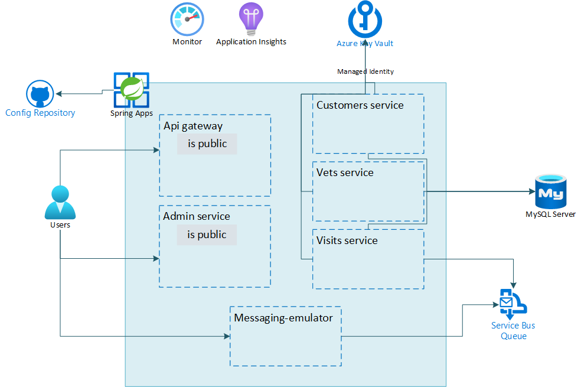

---
lab:
    Title: 'Challenge 05: Create and configure Azure Service Bus for Azure Spring Apps'
    Learn module: 'Learn module 5: Create and configure Azure Service Bus for Azure Spring Apps'
---

# Challenge 05: Create and configure Azure Service Bus for Azure Spring Apps

# Student manual

## Challenge scenario

You have now set up and deployed the Spring Petclinic application. Some of the microservices however also need to send messages to a third party system over a message bus and you want to enable an intake of telemetry events. You want to provide this functionality with native Azure services such as Azure Service Bus and Azure Event Hub. You will start by implementing support for outbound messaging.

## Objectives

After you complete this challenge, you will be able to:

- Create Azure Service Bus resources
- Test the messaging functionality
- Update the remaining microservice to use the message queues
- Add the message producers and listeners

The below image illustrates the end state you will be building in this challenge.



## Challenge Duration

- **Estimated Time**: 60 minutes

## Instructions

During this challenge, you will:

- Create Azure Service Bus resources
- Test the messaging functionality
- Update the remaining microservice to use the message queues
- Add the message producers and listeners

   > **Note**: The instructions provided in this exercise assume that you successfully completed the previous exercise and are using the same lab environment, including your Git Bash session with the relevant environment variables already set.

### Create Azure Service Bus resources

First, you need to create an Azure Service Bus namespace and one or more queues to send messages to. In your implementation, you will create a queue named `visits-requests`. You can use the following guidance to implement these changes:

- [Use the Azure CLI to create a Service Bus namespace and a queue](https://docs.microsoft.com/azure/service-bus-messaging/service-bus-quickstart-cli).
- [Use Azure CLI to create a Service Bus topic and subscriptions to the topic](https://docs.microsoft.com/azure/service-bus-messaging/service-bus-tutorial-topics-subscriptions-cli).

Make sure to create the Service Bus namespace with the **Premium** SKU, since this is required in order to support JMS 2.0 messaging. You should also add a connection string to your Service Bus namespace in the Key Vault instance you provisioned earlier in this lab, so the microservices can retrieve its value.

   > **Note**: As a more secure alternative, you could use managed identities associated with your microservices to connect directly to the Service Bus namespace. However, in this lab, you will store the connection string in your Key Vault.

The connection to the Service Bus needs to be stored in the `spring.jms.servicebus.connection-string` application property. Name your Key Vault secret `SPRING-JMS-SERVICEBUS-CONNECTIONSTRING` and add the following section to the `application.yml` file in your configuration repository.

   ```yaml
     jms:
       servicebus:
         connection-string: ${spring.jms.servicebus.connectionstring}
         idle-timeout: 60000
         pricing-tier: premium
   ```

> **Note**: Particular attention to indentation as shown above is important: `jms` should be at the same indentation level as `config`, `datasource` and `cloud`.

This translates the secret in Key Vault to the correct application property for your microservices. This usage of properties is described in the following documentation: [Special Characters in Property Name](https://microsoft.github.io/spring-cloud-azure/current/reference/html/index.html#special-characters-in-property-name).

<details>
<summary>hint</summary>
<br/>

1. On your lab computer, in Git Bash window, from the Git Bash prompt, run the following command to create a Service Bus namespace. Note that the name of the namespace needs to be globally unique, so adjust it accordingly in case the randomly generated name is already in use. You will need to create the namespace with the **Premium** sku. This is needed to use JMS 2.0 messaging later on in the lab.

   ```bash
   SERVICEBUS_NAMESPACE=sb-$APPNAME-$UNIQUEID

   az servicebus namespace create \
       --resource-group $RESOURCE_GROUP \
       --name $SERVICEBUS_NAMESPACE \
       --location $LOCATION \
       --sku Premium
   ```

   > **Note**: Wait for the operation to complete. This might take about 5 minutes.

1. Next, create a queue in this namespace named `visits-requests`.

   ```bash
   az servicebus queue create \
       --resource-group $RESOURCE_GROUP \
       --namespace-name $SERVICEBUS_NAMESPACE \
       --name visits-requests
   ```

1. Retrieve the value of the connection string to the newly created Service Bus namespace:

   ```bash
   SERVICEBUS_CONNECTIONSTRING=$(az servicebus namespace authorization-rule keys list \
       --resource-group $RESOURCE_GROUP \
       --namespace-name $SERVICEBUS_NAMESPACE \
       --name RootManageSharedAccessKey \
       --query primaryConnectionString \
       --output tsv)
   ```

1. Create a new Key Vault secret for this connection string.

   ```bash
   az keyvault secret set \
       --name SPRING-JMS-SERVICEBUS-CONNECTIONSTRING \
       --value $SERVICEBUS_CONNECTIONSTRING \
       --vault-name $KEYVAULT_NAME
   ```

1. In your configuration repository replace the `application.yml` with the contents of [this application.yml](../../config/05_application.yml) file. This file contains the following changes:

   * It adds the `spring.jms.servicebus` configuration on lines 16 to 20.
   * Make sure you replace the `<your-kv-name>` replacement value with the name of your Key Vault.

1. Commit and push your changes to the remote repository.

   ```bash
   cd ~/workspaces/Deploying-and-Running-Java-Applications-in-Azure-Spring-Apps
   git add .
   git commit -m 'added service bus'
   git push
   ```

</details>

### Test the messaging functionality

In the spring-petclinic-microservices repository, the `spring-petclinic-messaging-emulator` microservice is already prepared to send messages to an Azure Service Bus namespace. You can add this microservice to your current Spring Petclinic project in the parent `pom.xml` file, deploy it as an extra microservice in your Azure Spring Apps service and use this microservice's public endpoint to send messages to your Service Bus namespace. Test this functionality and inspect whether messages end up in the Service Bus namespace you just created by using the Service Bus Explorer for the `visits-requests` queue. You can use the following guidance to implement these changes:

- [Use Service Bus Explorer to run data operations on Service Bus (Preview)](https://docs.microsoft.com/azure/service-bus-messaging/explorer).

<details>
<summary>hint</summary>
<br/>

1. As a first step in the parent `pom.xml` file, you'll have to uncomment the module for the `spring-petclinic-messaging-emulator` in the `<modules>` element at line 26.

    ```xml
    <module>spring-petclinic-messaging-emulator</module>
    ```

1. Update the compiled version of the microservices available by running an additional build.

   ```bash
   cd ~/workspaces/Deploying-and-Running-Java-Applications-in-Azure-Spring-Apps/src
   mvn clean package -DskipTests -rf :spring-petclinic-messaging-emulator
   ```

1. Create a new application in your Spring Apps service for the `messaging-emulator` and assign a public endpoint to it.

   ```bash
   MESSAGING_EMULATOR=messaging-emulator
   az spring app create \
       --name $MESSAGING_EMULATOR \
       --assign-endpoint true
   ```

   > **Note**: Wait for the provisioning to complete. This might take about 3 minutes.

1. Update the Application Configuration Service to also pick up the messaging-emulator config.

   ```bash
   az spring application-configuration-service git repo update \
       --resource-group $RESOURCE_GROUP \
       --name spring-petclinic-config \
       --service $SPRING_APPS_SERVICE \
       --label main \
       --patterns "api-gateway,customers-service,vets-service,visits-service,admin-server,messaging-emulator" \
       --uri $GIT_REPO \
       --password $GIT_PASSWORD \
       --username $GIT_USERNAME
   ```

   > **Note**: In case you are using a branch other than `main` in your config repo, you can change the branch name with the `label` parameter.

   > **Note**: Wait for the operation to complete. This might take about 2 minutes.

1. Bind this new app to the Application Configuration Service and to the Service Registry.

   ```bash
   az spring application-configuration-service bind --app ${MESSAGING_EMULATOR}
   
   az spring service-registry bind --app ${MESSAGING_EMULATOR}
   ```

1. Create a new user assigned managed identity for this new application and assign it to the `messaging-emulator` app:

   ```bash
   MESSAGING_EMULATOR_ID=$(az identity create -g $RESOURCE_GROUP -n messaging-svc-uid --query id -o tsv)
   
   az spring app identity assign \
       --resource-group $RESOURCE_GROUP \
       --name $MESSAGING_EMULATOR \
       --user-assigned $MESSAGING_EMULATOR_ID   
   ```

1. Grant to the newly assigned identity the get and list permissions on your Key Vault secrets.

   ```bash
   MESSAGING_EMULATOR_UID=$(az identity show -g $RESOURCE_GROUP -n messaging-svc-uid --query principalId -o tsv)
   
   az keyvault set-policy \
       --name $KEYVAULT_NAME \
       --resource-group $RESOURCE_GROUP \
       --secret-permissions get list  \
       --object-id $MESSAGING_EMULATOR_UID
   ```

1. Since the messaging-emulator will also save data in the database, you will also need to create a service connection for it: 

   ```bash
   MESSAGING_EMULATOR_CID=$(az identity show -g $RESOURCE_GROUP -n messaging-svc-uid --query clientId -o tsv)
    
   az spring connection create mysql-flexible \
       --resource-group $RESOURCE_GROUP \
       --service $SPRING_APPS_SERVICE \
       --app $MESSAGING_EMULATOR \
       --target-resource-group $RESOURCE_GROUP \
       --server $MYSQL_SERVER_NAME \
       --database $DATABASE_NAME \
       --user-identity mysql-identity-id=$ADMIN_IDENTITY_RESOURCE_ID client-id=$MESSAGING_EMULATOR_CID subs-id=$SUBID
   ```

1. You can now deploy the messaging-emulator application.

   ```bash
   MESSAGING_EMULATOR_JAR=spring-petclinic-messaging-emulator/target/spring-petclinic-messaging-emulator-$VERSION.jar
   
   az spring app deploy --name ${MESSAGING_EMULATOR} \
       --config-file-patterns ${MESSAGING_EMULATOR} \
       --artifact-path ${MESSAGING_EMULATOR_JAR}
   ```

1. Switch to the web browser window displaying the Azure Portal, navigate to the resource group containing the resources you deployed in this lab, and, from there, navigate to the Azure Spring Apps Service.

1.  In the navigation menu, in the **Settings** section, select **Apps**, wait until the **Provisioning state** of the `messaging-emulator` app changes to **Succeeded**, and then select the `messaging-emulator` app entry.

    > **Note**: The provisioning might take about 3 minutes. Select **Refresh** in order to update the provisioning status.

1. Once provisioning is complete. Select the apps URL and open this in a new browser window.

1.  On the newly opened browser page titled **Message**, enter **1** in the **Pet** text box and a random text in the **Message** text box, and then select **Submit**.

1. In the Azure Portal, navigate to your resource group and select the Service Bus namespace you deployed in the previous task.

1. In the navigation menu, in the **Entities** section, select **Queues** and then select the `visits-requests` queue entry.

1. On the **Overview** page of the `visits-requests` queue, verify that the active message count is set to 1.

1. Select **Service Bus Explorer (Preview)** and select **Peek from start**. This operation allows you to peek at the top messages on the queue, without dequeuing them.

1. Select the message entry in the queue and review the **Message Body** section to confirm that its content matches the message you submitted.

</details>

You might want to inspect the code of the `messaging-emulator` microservice. Take a look at:

- The dependencies for the Service Bus in the `pom.xml` file.
- The `PetClinicVisitRequestSender` and `PetClinicMessageResponsesReceiver` classes in the `service` folder. These are the classes that enable sending and receiving of messages to and from a queue using JMS.
- The `PetClinicMessageRequest` and `PetClinicMessageResponse` classes in the `entity` folder. These are the messages being sent back and forth.
- The `MessagingConfig` class in the `config` folder. This class provides conversion to and from JSON.
- The `AzureServiceBusResource` class in the `web` folder. This class makes use of the above classed to send a message to the Service Bus.

In the next steps you will add similar functionality to the `visits` service.

### Update the remaining microservice to use the message queues

You have now reviewed how an existing microservice interacts with the Service Bus queue. In the upcoming task, you will enable the `visits` microservice to also read messages from a queue and write messages to another queue. You can use the following guidance to implement these changes:

- [Use Java Message Service 2.0 API with Azure Service Bus Premium](https://docs.microsoft.com/azure/service-bus-messaging/how-to-use-java-message-service-20).
- [How to use the Spring Boot Starter for Azure Service Bus JMS](https://docs.microsoft.com/azure/developer/java/spring-framework/configure-spring-boot-starter-java-app-with-azure-service-bus).

To start, you will need to add the necessary dependencies.

<details>
<summary>hint</summary>
<br/>

1. From the Git Bash window, in the spring-petclinic-microservices repository you cloned locally, use your favorite text editor to open the `spring-petclinic-microservices/spring-petclinic-visits-service/pom.xml` file of the `visits` microservice. In the `<!-- Spring Cloud -->` section, following the last dependency element, add the following dependency element:

   ```xml
           <dependency>
             <groupId>com.azure.spring</groupId>
             <artifactId>spring-cloud-azure-starter-servicebus-jms</artifactId>
           </dependency>
   ```

</details>

### Add the message producers and listeners

You will next add the code required to send and receive messages to the `visits` service. The `message-emulator` will send a `PetClinicMessageRequest` to the `visits-requests` queue. The `visits` service will need to listen to this queue and each time a `VisitRequest` message is submitted, it will create a new `Visit` for the pet ID referenced in the message. The `visits` service will also send back a `VisitResponse` as a confirmation to the `visits-confirmations` queue. This is the queue the `message-emulator` is listening to.

<details>
<summary>hint</summary>
<br/>

1. In the `spring-petclinic-visits-service` directory, create a new `src/main/java/org/springframework/samples/petclinic/visits/entities` subdirectory and add a `VisitRequest.java` class file containing the following code:

   ```java
   package org.springframework.samples.petclinic.visits.entities;
   
   import java.io.Serializable;
   import java.util.Date;
   
   public class VisitRequest implements Serializable {
       private static final long serialVersionUID = -249974321255677286L;
   
       private Integer requestId;
       private Integer petId;
       private String message;
   
       public VisitRequest() {
       }
   
       public Integer getRequestId() {
           return requestId;
       }
   
       public void setRequestId(Integer id) {
           this.requestId = id;
       }
   
       public Integer getPetId() {
           return petId;
       }
   
       public void setPetId(Integer petId) {
           this.petId = petId;
       }
   
       public String getMessage() {
           return message;
       }
   
       public void setMessage(String message) {
           this.message = message;
       }
   }
   ```

1. In the same directory, add a `VisitResponse.java` class containing the following code:

   ```java
   package org.springframework.samples.petclinic.visits.entities;
   
   public class VisitResponse {
       Integer requestId;
       Boolean confirmed;
       String reason;
   
       public VisitResponse() {
       }
   
       public VisitResponse(Integer requestId, Boolean confirmed, String reason) {
           this.requestId = requestId;
           this.confirmed = confirmed;
           this.reason = reason;
       }    
   
       public Boolean getConfirmed() {
           return confirmed;
       }
   
       public void setConfirmed(Boolean confirmed) {
           this.confirmed = confirmed;
       }
   
       public String getReason() {
           return reason;
       }
   
       public void setReason(String reason) {
           this.reason = reason;
       }
   
       public Integer getRequestId() {
           return requestId;
       }
   
       public void setRequestId(Integer requestId) {
           this.requestId = requestId;
       }
   }
   ```

1. In the `spring-petclinic-visits-service` directory, create a new `src/main/java/org/springframework/samples/petclinic/visits/config` subdirectory and add a `MessagingConfig.java` class file containing the following code:

   ```java
   package org.springframework.samples.petclinic.visits.config;
   import java.util.HashMap;
   import java.util.Map;
   import org.springframework.beans.factory.annotation.Value;
   import org.springframework.context.annotation.Bean;
   import org.springframework.context.annotation.Configuration;
   import org.springframework.jms.support.converter.MappingJackson2MessageConverter;
   import org.springframework.jms.support.converter.MessageConverter;
   import org.springframework.samples.petclinic.visits.entities.VisitRequest;
   import org.springframework.samples.petclinic.visits.entities.VisitResponse;
   @Configuration
   public class MessagingConfig {
       @Bean("QueueConfig")
       public QueueConfig queueConfig() {
           return new QueueConfig();
       }
       @Bean
       public MessageConverter jackson2Converter() {
           MappingJackson2MessageConverter converter = new MappingJackson2MessageConverter();
           Map<String, Class<?>> typeMappings = new HashMap<String, Class<?>>();
           typeMappings.put("visitRequest", VisitRequest.class);
           typeMappings.put("visitResponse", VisitResponse.class);
           converter.setTypeIdMappings(typeMappings);
           converter.setTypeIdPropertyName("messageType");
           return converter;
       }
   }
   ```

1. In the same directory, add a `QueueConfig.java` class file containing the following code:

   ```java
   package org.springframework.samples.petclinic.visits.config;
   
   import org.springframework.beans.factory.annotation.Value;
   
   public class QueueConfig {
       @Value("${spring.jms.queue.visits-requests:visits-requests}")
       private String visitsRequestsQueue;
   
       public String getVisitsRequestsQueue() {
           return visitsRequestsQueue;
       }   
   }
   ```

1. In the `spring-petclinic-visits-service` directory, create a new `src/main/java/org/springframework/samples/petclinic/visits/service` subdirectory and add a `VisitsReceiver.java` class file containing the following code:

   ```java
   package org.springframework.samples.petclinic.visits.service;
   
   import java.util.Date;
   
   import org.springframework.beans.factory.annotation.Value;
   import org.springframework.context.annotation.Bean;
   import org.springframework.jms.annotation.JmsListener;
   import org.springframework.jms.core.JmsTemplate;
   import org.springframework.samples.petclinic.visits.entities.VisitRequest;
   import org.springframework.samples.petclinic.visits.entities.VisitResponse;
   import org.springframework.samples.petclinic.visits.model.Visit;
   import org.springframework.samples.petclinic.visits.model.VisitRepository;
   import org.springframework.stereotype.Component;
   
   import lombok.RequiredArgsConstructor;
   import lombok.extern.slf4j.Slf4j;
   
   @Component
   @Slf4j
   @RequiredArgsConstructor
   public class VisitsReceiver {
       private final VisitRepository visitsRepository;
   
       private final JmsTemplate jmsTemplate;
   
       @JmsListener(destination = "visits-requests")
       void receiveVisitRequests(VisitRequest visitRequest) {
           log.info("Received message: {}", visitRequest.getMessage());
           try {
               Visit visit = new Visit(null, new Date(), visitRequest.getMessage(),
                     visitRequest.getPetId());
                  visitsRepository.save(visit);
                  jmsTemplate.convertAndSend("visits-confirmations", new VisitResponse(visitRequest.getRequestId(), true, "Your visit request has been accepted"));
           } catch (Exception ex) {
               log.error("Error saving visit: {}", ex.getMessage());
               jmsTemplate.convertAndSend("visits-confirmations", new VisitResponse(visitRequest.getRequestId(), false, ex.getMessage()));
           }
       }
   }
   ```

This `VisitsReceiver` service is listening to the `visits-requests` queue. Each time a message is present on the queue, it will dequeue this message and save a new `Visit` in the database. In the next step, you will verify it by having it sent a confirmation message to the `visits-confirmations` queue.  

1. Rebuild your application

   ```bash
   mvn clean package -DskipTests -rf :spring-petclinic-visits-service
   ```

1. Redeploy the visits microservice.

   ```bash
   az spring app deploy --name ${VISITS_SERVICE} \
       --config-file-patterns ${VISITS_SERVICE} \
       --artifact-path ${VISITS_SERVICE_JAR} 
   ```

1. To validate the resulting functionality, in the Azure Portal, navigate back to the page of the `visits-requests` queue of the Service Bus namespace you deployed earlier in this lab.

1. On the **Overview** page of the `visits-requests` queue, verify that there are no active messages.

1. In the web browser window, open another tab and navigate to the public endpoint of the `api-gateway` service.

1. On the **Welcome to Petclinic** page, select **Owners** and, in the drop-down menu, select **All**.

1. In the list of owners, select the first entry (**George Franklin**).

1. On the **Owner Information** page, in the **Pets and Visits** section, verify the presence of an entry representing the message you submitted earlier in this lab.

1. You can also check the logs of the `vistis-service` to see if you see the log message on the message receive.

   ```bash
   az spring app logs --name ${VISITS_SERVICE} --follow
   ```

</details>

#### Review

In this lab, you implemented support for outbound messaging by Azure Spring Apps applications.
