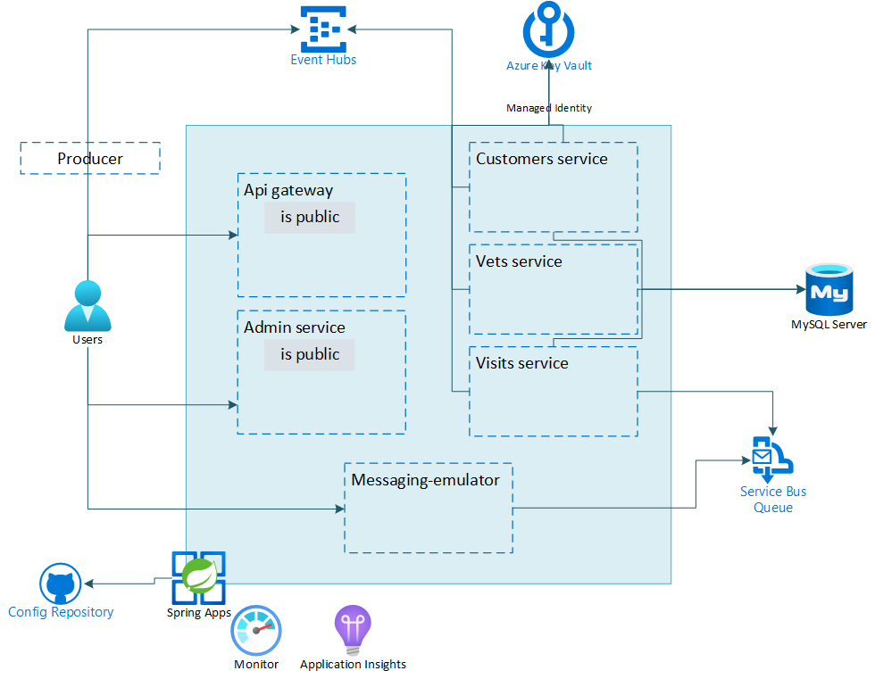

---
lab:
    Title: 'Challenge 06: Configure Azure Event Hubs for Azure Spring Apps'
    Learn module: 'Learn module 6: Configure Azure Event Hubs for Azure Spring Apps'
---

# Challenge 06: Configure Azure Event Hubs for Azure Spring Apps

# Student manual

## Challenge scenario

You have completed implement messaging functionality for the Spring Petclinic application. Now, you will implement the event processing functionality by integrating your application with Event Hub.

## Objectives

After you complete this challenge, you will be able to:

- Create an Azure Event Hub resource
- Update an existing microservice to send events to the Event Hub
- Update an existing microservice to receive Event Hub events
- Inspect telemetry data being received

The below image illustrates the end state you will be building in this challenge.



## Challenge Duration

- **Estimated Time**: 60 minutes

## Instructions

During this challenge, you will:

- Create an Azure Event Hub resource
- Update an existing microservice to send events to the Event Hub
- Update an existing microservice to receive Event Hub events
- Inspect telemetry data being received

### Create Event Hub resource

You will first need to create an Azure Event Hub namespace to send events to. Create an Event Hub namespace and assign to it a globally unique name. In the namespace you will then create an event hub named `telemetry`. You will be connecting to the Event Hub by authenticating with the managed identities you created in earlier labs. You can use the following guidance to implement these changes:

- [Quickstart: Create an event hub using Azure CLI](https://docs.microsoft.com/azure/event-hubs/event-hubs-quickstart-cli).
- [Authenticate a managed identity with Azure Active Directory to access Event Hubs Resources](https://docs.microsoft.com/azure/event-hubs/authenticate-managed-identity?tabs=latest).


<details>
<summary>hint</summary>
<br/>

1. On your lab computer, in the Git Bash window, from the Git Bash prompt, run the following command to create an Event Hub namespace. The name you use for your namespace should be globally unique, so adjust it accordingly in case the randomly generated name is already in use.

   ```bash
   EVENTHUBS_NAMESPACE=evhns-$APPNAME-$UNIQUEID

   az eventhubs namespace create \
     --resource-group $RESOURCE_GROUP \
     --name $EVENTHUBS_NAMESPACE \
     --location $LOCATION
   ```

1. Next, create an event hub named `telemetry` in the newly created namespace.

   ```bash
   EVENTHUB_NAME=telemetry

   az eventhubs eventhub create \
     --name $EVENTHUB_NAME \
     --resource-group $RESOURCE_GROUP \
     --namespace-name $EVENTHUBS_NAMESPACE
   ```

1. You will be connecting to the event hub with the identities of the `customers` and `vets` microservices you created earlier. You will need to provide these identities access to the event hub.

   ```bash
   EVENTHUB_ID=$(az eventhubs namespace show --name $EVENTHUBS_NAMESPACE --resource-group $RESOURCE_GROUP --query id -o tsv)
   az role assignment create --assignee $CUSTOMERS_SERVICE_CID --role 'Azure Event Hubs Data Owner' --scope $EVENTHUB_ID
   az role assignment create --assignee $VETS_SERVICE_CID --role 'Azure Event Hubs Data Owner' --scope $EVENTHUB_ID
   ```

</details>

### Update an existing microservice to send events to the Event Hub

You will now implement the functionality that will allow you to emulate sending events to the telemetry Event Hub. For this you will update the `customers-service`. Each time a new customer gets created, send a new event to the event hub, together with 100 new pet events (we are going to simulate some dummy load).

- [Sending and Receiving Message by Azure Event Hubs and Spring Cloud Stream Binder Eventhubs in Spring Boot Application](https://github.com/Azure-Samples/azure-spring-boot-samples/tree/main/eventhubs/spring-cloud-azure-stream-binder-eventhubs/eventhubs-binder)
- [Spring Cloud Stream with Azure Event Hubs](https://learn.microsoft.com/azure/developer/java/spring-framework/configure-spring-cloud-stream-binder-java-app-azure-event-hub?toc=%2Fazure%2Fevent-hubs%2FTOC.json)


<details>
<summary>hint</summary>
<br/>

1. In the `customers-service` `pom.xml` file, add the following extra dependency:

   ```bash
       <dependency>
         <groupId>com.azure.spring</groupId>
         <artifactId>spring-cloud-azure-stream-binder-eventhubs</artifactId>
       </dependency>
   ```

1. Replace the contents of the  **src/main/java/org/springframework/samples/petclinic/customers/CustomersServiceApplication.java** file with:

   ```java
   package org.springframework.samples.petclinic.customers;
   
   import org.springframework.boot.SpringApplication;
   import org.springframework.boot.autoconfigure.SpringBootApplication;
   import org.springframework.cloud.client.discovery.EnableDiscoveryClient;
   
   import org.springframework.integration.annotation.ServiceActivator;
   import org.springframework.messaging.Message;
   import org.slf4j.Logger;
   import org.slf4j.LoggerFactory;
   
   /**
    * @author Maciej Szarlinski
    */
   @EnableDiscoveryClient
   @SpringBootApplication
   public class CustomersServiceApplication {
   
   	private static final Logger LOGGER = LoggerFactory.getLogger(CustomersServiceApplication.class);
   
   	public static void main(String[] args) {
   		SpringApplication.run(CustomersServiceApplication.class, args);
   	}
   
   	@ServiceActivator(inputChannel = "telemetry.errors")
       public void producerError(Message<?> message) {
           LOGGER.error("Handling Producer ERROR: " + message);
       }
   }   
   ```

   This adds an extra logger and a method that will be called in case of errors in the sending of events.

1. Replace the contents of the  **src/spring-petclinic-customers-service/src/main/java/org/springframework/samples/petclinic/customers/web/OwnerResource.java** file with:

   ```java
   package org.springframework.samples.petclinic.customers.web;
   
   import io.micrometer.core.annotation.Timed;
   import lombok.RequiredArgsConstructor;
   import lombok.extern.slf4j.Slf4j;
   import org.springframework.http.HttpStatus;
   import org.springframework.samples.petclinic.customers.model.Owner;
   import org.springframework.samples.petclinic.customers.model.OwnerRepository;
   import org.springframework.web.bind.annotation.*;
   
   import jakarta.validation.Valid;
   import jakarta.validation.constraints.Min;
   import java.util.List;
   import java.util.Optional;
   
   import reactor.core.publisher.Sinks;
   import reactor.core.publisher.Flux;
   import org.springframework.messaging.Message;
   import org.springframework.messaging.support.MessageBuilder;
   import org.slf4j.Logger;
   import org.slf4j.LoggerFactory;
   import org.springframework.context.annotation.Bean;
   import java.util.function.Supplier;
   
   import org.springframework.beans.factory.annotation.Autowired;
   
   /**
    * @author Juergen Hoeller
    * @author Ken Krebs
    * @author Arjen Poutsma
    * @author Michael Isvy
    * @author Maciej Szarlinski
    */
   @RequestMapping("/owners")
   @RestController
   @Timed("petclinic.owner")
   @RequiredArgsConstructor
   @Slf4j
   class OwnerResource {
   
       private final OwnerRepository ownerRepository;
   
       @Autowired
       private Sinks.Many<Message<String>> many;
   
       private static final Logger LOGGER = LoggerFactory.getLogger(OwnerResource.class);
   
       /**
        * Create Owner
        */
       @PostMapping
       @ResponseStatus(HttpStatus.CREATED)
       public Owner createOwner(@Valid @RequestBody Owner owner) {
           LOGGER.info("+++Sending events+++");
           many.emitNext(MessageBuilder.withPayload("New owner created: " + owner.getFirstName() + " " + owner.getLastName() + " with many pets ...").build(), Sinks.   EmitFailureHandler.FAIL_FAST);
           for(int i = 0; i < 100; i++) {
               many.emitNext(MessageBuilder.withPayload("Pet " + i).build(), Sinks.EmitFailureHandler.FAIL_FAST);
           }
   
           return ownerRepository.save(owner);
       }
   
       /**
        * Read single Owner
        */
       @GetMapping(value = "/{ownerId}")
       public Optional<Owner> findOwner(@PathVariable("ownerId") @Min(1) int ownerId) {
           return ownerRepository.findById(ownerId);
       }
   
       /**
        * Read List of Owners
        */
       @GetMapping
       public List<Owner> findAll() {
           return ownerRepository.findAll();
       }
   
       /**
        * Update Owner
        */
       @PutMapping(value = "/{ownerId}")
       @ResponseStatus(HttpStatus.NO_CONTENT)
       public void updateOwner(@PathVariable("ownerId") @Min(1) int ownerId, @Valid @RequestBody Owner ownerRequest) {
           final Optional<Owner> owner = ownerRepository.findById(ownerId);
           final Owner ownerModel = owner.orElseThrow(() -> new ResourceNotFoundException("Owner "+ownerId+" not found"));
   
           // This is done by hand for simplicity purpose. In a real life use-case we should consider using MapStruct.
           ownerModel.setFirstName(ownerRequest.getFirstName());
           ownerModel.setLastName(ownerRequest.getLastName());
           ownerModel.setCity(ownerRequest.getCity());
           ownerModel.setAddress(ownerRequest.getAddress());
           ownerModel.setTelephone(ownerRequest.getTelephone());
           log.info("Saving owner {}", ownerModel);
           ownerRepository.save(ownerModel);
       }
   }
   ```

   This adds an additional sync, that is used in the `createOwner` method to add events to.

1. In the **/src/spring-petclinic-customers-service/src/main/java/org/springframework/samples/petclinic/customers/config/** folder, add an extra `ManualProducerConfiguration.java` file with the below contents:

   ```java
   package org.springframework.samples.petclinic.customers.config;
   
   
   import com.azure.spring.messaging.eventhubs.support.EventHubsHeaders;
   import com.azure.spring.messaging.AzureHeaders;
   import com.azure.spring.messaging.checkpoint.Checkpointer;
   import org.slf4j.Logger;
   import org.slf4j.LoggerFactory;
   import org.springframework.context.annotation.Bean;
   import org.springframework.context.annotation.Configuration;
   import org.springframework.context.annotation.Profile;
   import org.springframework.messaging.Message;
   import reactor.core.publisher.Flux;
   import reactor.core.publisher.Sinks;
   
   import java.util.function.Consumer;
   import java.util.function.Supplier;
   
   @Configuration
   public class ManualProducerConfiguration {
   
       private static final Logger LOGGER = LoggerFactory.getLogger(ManualProducerConfiguration.class);
   
       @Bean
       public Sinks.Many<Message<String>> many() {
           return Sinks.many().unicast().onBackpressureBuffer();
       }
   
       @Bean
       public Supplier<Flux<Message<String>>> supply(Sinks.Many<Message<String>> many) {
           return () -> many.asFlux()
                            .doOnNext(m -> LOGGER.info("Manually sending message {}", m))
                            .doOnError(t -> LOGGER.error("Error encountered", t));
       }
   }   
   ```

   The `ManualProducerConfiguration` uses the sync to send the events to the event hub.

1. Update the **/src/spring-petclinic-customers-service/src/main/resources/application.yml** file, and replace its contents with:

   ```yaml
   spring:
     application:
       name: customers-service
     config:
       import: optional:configserver:${CONFIG_SERVER_URL:http://localhost:8888/}
     cloud:
       function: supply;       
   ```

   This adds an extra spring cloud function for the supply method in the `ManualProducerConfiguration` class.

1. Save the changes to all 4 files.

1. In the config repository you will need to add the configuration for sending messages to the event hub. Replace the contents of the current `application.yml` file with the contents of [this application.yml](../../../config/06_application.yml) file. Make sure you fill out your current Key Vault name on line `36`. This file includes the following changes:

   - It configures the output stream for `supply-out-0` to use the telemetry endpoint of the event hub on line `40`.
   - It indicates the namespace you want to connect to on line `51`. Make sure to provide here the name of your event hubs namespace.
   - It adds some values for polling on lines `52` to `54`.

   {: .note }
   > Notice that this extra configuration does not include any mention to connection strings, passwords or tokens. The connection will happen based on the user assigned managed identities. Getting the token from AAD is all provided by the `spring-cloud-azure-stream-binder-eventhubs` library.

1. Commit these changes to the config repo.

   ```bash
   git add .
   git commit -m 'added event hub supply'
   git push   
   ```

1. From the Git Bash window, set the current working directory to the `Deploying-and-Running-Java-Applications-in-Azure-Spring-Apps/src` folder and run a maven build.

   ```bash
   cd ~/workspaces/Deploying-and-Running-Java-Applications-in-Azure-Spring-Apps/src
   mvn clean package -DskipTests -rf :spring-petclinic-customers-service
   ```

1. Once the build is complete, redeploy the `customers` service.

   ```bash
   az spring app deploy --name ${CUSTOMERS_SERVICE} \
       --config-file-patterns ${CUSTOMERS_SERVICE} \
       --artifact-path ${CUSTOMERS_SERVICE_JAR} 
   ```

1. Open the `customers` service log stream so you can see there are no errors.

   ```bash
   az spring app logs --name ${CUSTOMERS_SERVICE} --follow
   ```

   > **Note**: In case you see errors, review the steps you executed and retry. The [LabTips file](../../../LabTips.md) also contains steps on how to recover from errors.

1. With the log stream still open, in your browser window, navigate to the applications public endpoint and select `Owners - Register`. On the registration page, fill out the details for a new owner and select `Submit`. When you select `Submit` you should see output in the `customers` service logs indicating events were send to the eventhub. 

1. In your git bash window, close the log stream with `Ctrl + C`.

</details>

### Update an existing microservice to receive Event Hub events

In this task, you will update the vets microservice to receive events from the telemetry event hub. You can use the following guidance to implement these changes:

- [Sending and Receiving Message by Azure Event Hubs and Spring Cloud Stream Binder Eventhubs in Spring Boot Application](https://github.com/Azure-Samples/azure-spring-boot-samples/tree/main/eventhubs/spring-cloud-azure-stream-binder-eventhubs/eventhubs-binder)
- [Spring Cloud Stream with Azure Event Hubs](https://learn.microsoft.com/azure/developer/java/spring-framework/configure-spring-cloud-stream-binder-java-app-azure-event-hub?toc=%2Fazure%2Fevent-hubs%2FTOC.json)
- [Use Java to send events to or receive events from Azure Event Hubs](https://learn.microsoft.com/azure/event-hubs/event-hubs-java-get-started-send?tabs=passwordless%2Croles-azure-portal)


<details>
<summary>hint</summary>
<br/>

1. Reading the messages from the event hub, also entails that you will need to checkpoint what part of the stream you already read and processed. For keeping track of the checkpoints you will use a storage account. Create the storage account and a container with the below steps:

   ```bash
   STORAGE_ACCOUNT_NAME=stg$APPNAME$UNIQUEID
   echo $STORAGE_ACCOUNT_NAME
   az storage account create --name $STORAGE_ACCOUNT_NAME --resource-group $RESOURCE_GROUP --location $LOCATION --sku "Standard_LRS" 
   az storage account show --name $STORAGE_ACCOUNT_NAME --resource-group $RESOURCE_GROUP --query id -o tsv
   STORAGE_ACCOUNT_ID=$(az storage account show --name $STORAGE_ACCOUNT_NAME --resource-group $RESOURCE_GROUP --query id -o tsv)
   echo $STORAGE_ACCOUNT_ID
   ```

1. For creating the storage container, you will need to make sure your current account has sufficient permissions on the storage account.

   ```bash
   CURRENT_USER_OBJECTID=$(az ad signed-in-user show --query id --output tsv)
   az role assignment create --assignee $CURRENT_USER_OBJECTID --role 'Storage Account Contributor' --scope $STORAGE_ACCOUNT_ID
   az role assignment create --assignee $CURRENT_USER_OBJECTID --role 'Storage Blob Data Contributor' --scope $STORAGE_ACCOUNT_ID
   ```

1. You can now create the storage container.

   ```bash
   STORAGE_CONTAINER=eventhubs-binder
   az storage container create --name $STORAGE_CONTAINER --account-name $STORAGE_ACCOUNT_NAME --public-access container --auth-mode login
   ```

1. The checkpointing will be done through AAD authentication with the user assigned managed identity of the `vets` service. You will need to give the managed identity access to the storage container:

   ```bash
   az role assignment create --assignee $VETS_SERVICE_CID --role 'Storage Account Contributor' --scope $STORAGE_ACCOUNT_ID
   az role assignment create --assignee $VETS_SERVICE_CID --role 'Storage Blob Data Contributor' --scope $STORAGE_ACCOUNT_ID
   az role assignment create --assignee $VETS_SERVICE_CID --role 'Storage Blob Data Owner' --scope $STORAGE_ACCOUNT_ID/containers/$STORAGE_CONTAINER
   ```

1. In the config repository you will need to add the configuration for receiving messages from the event hub. Replace the contents of the current `application.yml` file with the contents of [this application.yml](../../../config/06b_application.yml) file. Make sure you fill out your current Key Vault name on line `36` and the name of your event hub namespace on line `54`. This file includes the following changes:

   - An additional `consume` binding for the `$Default` consumer group of the `telemetry` event hub on line `40` to `42`.
   - An additional `checkpoint-store` for the `eventshubs-binder` container of your storage account on lines `56` to `58`. Make sure you fill out the name of your storage account on line `58`.
   - An additional `spring.cloud.eventhubs.bindings` configuration indicating checkpointing will be done `MANUAL` on lines `59` to `64`.

1. Now that the configuration is done, you will update the `spring-petclinic-vets-service`. In your local application repository, use your favorite text editor to open the `pom.xml` file of the `spring-petclinic-vets-service` microservice, add to it another dependency element within the `<!-- Spring Cloud -->` section of the `<dependencies>` element, and save the change:

   ```xml
    <dependency>
      <groupId>com.azure.spring</groupId>
      <artifactId>spring-cloud-azure-stream-binder-eventhubs</artifactId>
    </dependency>  
   ```

1. In the `spring-petclinic-microservices/spring-petclinic-vets-service/src/main/java/org/springframework/samples/petclinic/vets` folder, update the `VetsServiceApplication.java` file with the below code:

   ```java
   package org.springframework.samples.petclinic.vets;
   
   import org.springframework.boot.SpringApplication;
   import org.springframework.boot.autoconfigure.SpringBootApplication;
   import org.springframework.boot.context.properties.EnableConfigurationProperties;
   import org.springframework.cloud.client.discovery.EnableDiscoveryClient;
   import org.springframework.samples.petclinic.vets.system.VetsProperties;
   
   import org.springframework.integration.annotation.ServiceActivator;
   import org.springframework.messaging.Message;
   import org.slf4j.Logger;
   import org.slf4j.LoggerFactory;
   
   /**
    * @author Maciej Szarlinski
    */
   @EnableDiscoveryClient
   @SpringBootApplication
   @EnableConfigurationProperties(VetsProperties.class)
   public class VetsServiceApplication {
   
   	private static final Logger LOGGER = LoggerFactory.getLogger(VetsServiceApplication.class);
   
   	public static void main(String[] args) {
   		SpringApplication.run(VetsServiceApplication.class, args);
   	}
   
   	@ServiceActivator(inputChannel = "telemetry.$Default.errors")
       public void consumerError(Message<?> message) {
           LOGGER.error("Handling consumer ERROR: " + message);
       }
   }
   ```

   This adds a `consumeError` method to this class, which will be called in case of errors with the connection to your event hub.

1. In the `spring-petclinic-microservices/spring-petclinic-vets-service/src/main/java/org/springframework/samples/petclinic/vets` folder, add a new `services` folder and create a `EventHubListener.java` in this folder with the below contents.

   ```java
   package org.springframework.samples.petclinic.vets.services;
   
   
   import com.azure.spring.messaging.eventhubs.support.EventHubsHeaders;
   import com.azure.spring.messaging.checkpoint.Checkpointer;
   import org.slf4j.Logger;
   import org.slf4j.LoggerFactory;
   import org.springframework.context.annotation.Bean;
   import org.springframework.context.annotation.Configuration;
   import org.springframework.context.annotation.Profile;
   import org.springframework.messaging.Message;
   import org.springframework.messaging.support.MessageBuilder;
   import org.springframework.samples.petclinic.vets.VetsServiceApplication;
   import org.springframework.stereotype.Service;
   
   import java.util.function.Consumer;
   
   import static com.azure.spring.messaging.AzureHeaders.CHECKPOINTER;
   
   @Configuration
   public class EventHubListener {
   
       private static final Logger LOGGER = LoggerFactory.getLogger(VetsServiceApplication.class);
   
       private int i = 0;
   
       @Bean
       public Consumer<Message<String>> consume() {
           return message -> {
               Checkpointer checkpointer = (Checkpointer) message.getHeaders().get(CHECKPOINTER);
               LOGGER.info("New message received: '{}', partition key: {}, sequence number: {}, offset: {}, enqueued time: {}",
                       message.getPayload(),
                       message.getHeaders().get(EventHubsHeaders.PARTITION_KEY),
                       message.getHeaders().get(EventHubsHeaders.SEQUENCE_NUMBER),
                       message.getHeaders().get(EventHubsHeaders.OFFSET),
                       message.getHeaders().get(EventHubsHeaders.ENQUEUED_TIME)
               );
   
               checkpointer.success()
                       .doOnSuccess(success -> LOGGER.info("Message '{}' successfully checkpointed", message.getPayload()))
                       .doOnError(error -> LOGGER.error("Exception found", error))
                       .block();
           };
       }
   }   
   ```

   This class has a `consume` method for consuming messages from the event hub. It uses a checkpointer to indicate which messages in the stream already got processed. With the logger we write out the message that got received.

1. In the `spring-petclinic-microservices/spring-petclinic-vets-service/src/main/resources` folder, update the contents of the `application.yml` file with the below contents:

   ```yaml
   spring:
     application:
       name: vets-service
     config:
       import: optional:configserver:${CONFIG_SERVER_URL:http://localhost:8888/}
     cache:
       cache-names: vets
     cloud:
       function: consume; 
   ```

   This adds the configuration for the cloud function of the consume method.

1. Make sure you saved all the files you just changed. In the Git Bash window, navigate back to the root folder of the spring petclinic repository and rebuild the vets microservice.

   ```bash
   cd ~/workspaces/Deploying-and-Running-Java-Applications-in-Azure-Spring-Apps/src
   mvn clean package -DskipTests -rf :spring-petclinic-vets-service
   ```

1. Redeploy the `vets-service` microservice to Azure Spring Apps.

   ```bash
   az spring app deploy --name ${VETS_SERVICE} \
       --config-file-patterns ${VETS_SERVICE}  \
       --artifact-path ${VETS_SERVICE_JAR} 
   ```

</details>

### Inspect telemetry data being received

To conclude this lab, you will create another owner in the application to send events to your event hub and use output logs of the vets microservice to verify that these messages are being received.

<details>
<summary>hint</summary>
<br/>

1. In the git bash window, open the log stream of the `vets` microservice.

   ```bash
   az spring app logs --name ${VETS_SERVICE} --follow
   ```

   > **Note**: In case you see errors, review the steps you executed and retry. The [LabTips file](../../../LabTips.md) also contains steps on how to recover from errors.

1. In your browser window, navigate to the applications' public endpoint and select `Owners - Register`. On the registration page, fill out the details for a new owner and select `Submit`. When you select `Submit` you should see output in the `vets` service logs indicating events were received from the eventhub. 

1. Switch to the web browser displaying the Azure portal, navigate to the page of the resource group containing resources you provisioned in this lab, and select the entry representing your Event Hub namespace.

   > **Note**: In case you don't see your Event Hub namespace in the list, select the refresh button.

1. On the Event Hub namespace page, in the navigation menu, in the **Entities** section, select **Event Hubs** and then select the `telemetry` event hub entry.

1. On the **Overview** page, review the **Messages** graph to verify that it includes metrics representing incoming and outgoing messages.

</details>

#### Review

In this lab, you implemented support for event processing by Azure Spring Apps applications.
