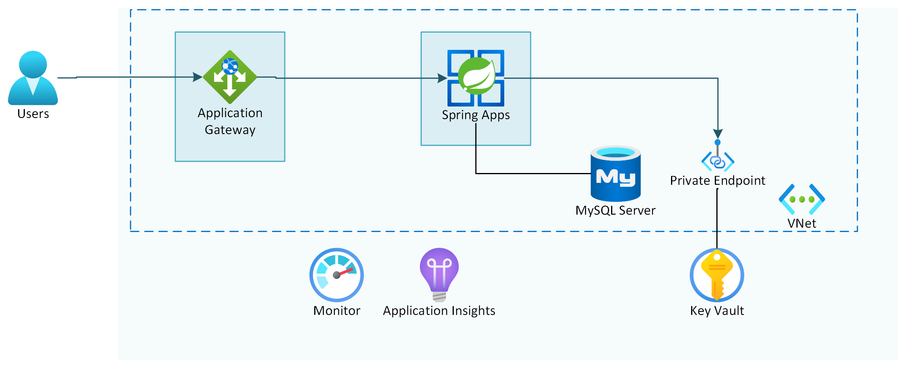

---
lab:
    Title: 'Challenge 08: Secure MySQL database and Key Vault using a Private Endpoint'
    Learn module: 'Learn module 8: Secure MySQL database and Key Vault using a Private Endpoint'
---

# Challenge 08: Secure MySQL database and Key Vault using a Private Endpoint

# Student manual

## Challenge scenario

You now have your Azure Spring Apps service deployed into a virtual network and the microservices connection requests from the internet must pass through your Application Gateway instance with Web Application Firewall enabled. However, the apps communicate with the backend services, such Azure Database for MySQL Flexible Server, Key Vault, Service Bus and Event Hub via their public endpoints. In this exercise, you will lock them down by implementing a configuration in which they only accept connections that originate from within your virtual network.

## Objectives

After you complete this challenge, you will be able to:

- Lock down the Azure Database for MySQL Flexible Server instance by using a private endpoint
- Lock down the Key Vault instance by using a private endpoint
- Test your setup

The below image illustrates the end state you will be building in this challenge.



## Challenge Duration

- **Estimated Time**: 60 minutes

## Instructions

During this challenge, you will:

- Lock down the Azure Database for MySQL Flexible Server instance by using a private endpoint
- Lock down the Key Vault instance by using a private endpoint
- Test your setup

   > **Note**: The instructions provided in this exercise assume that you successfully completed the previous exercise and are using the same lab environment, including your Git Bash session with the relevant environment variables already set.

   > **Note**: Since adding private endpoints to services is very similar across services, we will leave locking down the Service Bus and Event Hub namespace as an additional exercise for you, without adding the step by step instructions.

### Lock down the Azure Database for MySQL Flexible Server instance by using a private endpoint

To start, you need to lock down access to your MySQL database by using a private endpoint. This will protect the database content. A private endpoint is represented by a private IP address within a virtual network. Once you enable it, you can block public access to your MySQL Flexible Server. To accomplish this, you can use the following guidance:

- [Create and manage Private Link for Azure Database for MySQL - Flexible Server using CLI](https://learn.microsoft.com/azure/mysql/flexible-server/how-to-networking-private-link-azure-cli).
- [Private Link for Azure Database for MySQL - Flexible Server](https://learn.microsoft.com/azure/mysql/flexible-server/concepts-networking-private-link)


<details>
<summary>hint</summary>
<br/>

1. In the previous lab you already created the subnet for the private endpoints. For this subnet you need to disable private endpoint network policies.

   ```bash
   az network vnet subnet update \
      --name $PRIVATE_ENDPOINTS_SUBNET_NAME \
      --resource-group $RESOURCE_GROUP \
      --vnet-name $VIRTUAL_NETWORK_NAME \
      --disable-private-endpoint-network-policies true
   ```

1. You can now create a private endpoint for the MySQL instance.

   ```bash
   MYSQL_RESOURCE_ID=$(az resource show -g $RESOURCE_GROUP -n $MYSQL_SERVER_NAME --resource-type "Microsoft.DBforMySQL/flexibleServers" --query "id" -o tsv)

   az network private-endpoint create \
       --name pe-openlab-mysql \
       --resource-group $RESOURCE_GROUP \
       --vnet-name $VIRTUAL_NETWORK_NAME  \
       --subnet $PRIVATE_ENDPOINTS_SUBNET_NAME \
       --private-connection-resource-id $MYSQL_RESOURCE_ID \
       --group-id mysqlServer \
       --connection-name openlab-mysql-connection \
       --location $LOCATION
   ```

   {: .note }
   > Once you created the private endpoint, you will set up a private Azure DNS zone named `privatelink.mysql.database.azure.com` with an `A` DNS record matching the original DNS name with the suffix `mysql.database.azure.com` but replacing that suffix with `privatelink.mysql.database.azure.com`. Your apps connecting to the MySQL will not need to be updated, but instead they can continue using the existing connection settings.


1. To implement this configuration, start by creating a new private DNS zone and linking it to your virtual network.

   ```bash
   az network private-dns zone create \
       --resource-group $RESOURCE_GROUP \
       --name  "privatelink.mysql.database.azure.com"

   az network private-dns link vnet create \
       --resource-group $RESOURCE_GROUP \
       --zone-name  "privatelink.mysql.database.azure.com"\
       --name MyMySQLDNSLink  \
       --virtual-network $VIRTUAL_NETWORK_NAME \
       --registration-enabled false
   ```

1. Next, create a new `A` record pointing to the IP address of the newly created private endpoint.

   ```bash
   MYSQL_NIC_ID=$(az network private-endpoint show --name pe-openlab-mysql --resource-group $RESOURCE_GROUP --query 'networkInterfaces[0].id' -o tsv)
   MYSQL_NIC_IPADDRESS=$(az resource show --ids $MYSQL_NIC_ID --api-version 2019-04-01 -o json | jq -r '.properties.ipConfigurations[0].properties.privateIPAddress')

   az network private-dns record-set a create \
       --name $MYSQL_SERVER_NAME \
       --zone-name privatelink.mysql.database.azure.com \
       --resource-group $RESOURCE_GROUP

   az network private-dns record-set a add-record \
       --record-set-name $MYSQL_SERVER_NAME \
       --zone-name privatelink.mysql.database.azure.com \
       --resource-group $RESOURCE_GROUP \
       -a $MYSQL_NIC_IPADDRESS
   ```

1. You can now disable all public access towards your MySQL.

   ```bash
   az mysql flexible-server update \
      --name $MYSQL_SERVER_NAME \
      --resource-group $RESOURCE_GROUP \
      --public-access Disabled
   ```

1. You should be able to browse the spring petclinic app and still see the data. You don't need to restart the apps for this, everything should keep on working.

1. In the Azure Portal navigate to your newly created MySQL Flexible Server and select the `Networking` menu. In the menu you will notice public access is not allowed and the private endpoint is configured on the server.

</details>


### Lock down the Key Vault instance by using a private endpoint

Once you have locked down the internet access to the MySQL database, you will apply a private endpoint to the Key Vault as well to protect the Key Vault content. Once you enable it, you can block public access to your Key Vault as well. To accomplish this, you can use the following guidance:

- [Integrate Key Vault with Azure Private Link](https://docs.microsoft.com/azure/key-vault/general/private-link-service?tabs=cli).

<details>
<summary>hint</summary>
<br/>

1. You need to create a private endpoint for the Key Vault instance.

   ```bash
   KEYVAULT_RESOURCE_ID=$(az resource show -g ${RESOURCE_GROUP} -n ${KEYVAULT_NAME} --query "id" --resource-typ "Microsoft.KeyVault/vaults" -o tsv)

   az network private-endpoint create --resource-group $RESOURCE_GROUP \
       --vnet-name $VIRTUAL_NETWORK_NAME \
       --subnet $PRIVATE_ENDPOINTS_SUBNET_NAME \
       --name pe-openlab-keyvault \
       --private-connection-resource-id "$KEYVAULT_RESOURCE_ID" \
       --group-id vault \
       --connection-name openlab-keyvault-connection \
       --location $LOCATION
   ```

   > **Note**: Once you created the private endpoint, you will set up a private Azure DNS zone named `privatelink.vaultcore.azure.net` with an `A` DNS record matching the original DNS name with the suffix `vault.azure.net` but replacing that suffix with `privatelink.vaultcore.azure.net`. Your apps connecting to the Key Vault will not need to be updated, but instead they can continue using the existing endpoint info.

1. To implement this configuration, start by creating a new private DNS zone and linking it to your virtual network.

   ```bash
   az network private-dns zone create \
       --resource-group $RESOURCE_GROUP \
       --name "privatelink.vaultcore.azure.net"

   az network private-dns link vnet create \
       --resource-group $RESOURCE_GROUP \
       --zone-name "privatelink.vaultcore.azure.net" \
       --name MyVaultDNSLink \
       --virtual-network $VIRTUAL_NETWORK_NAME \
       --registration-enabled false
   ```

1. Next, create a new `A` record pointing to the IP address of the newly created private endpoint.

   ```bash
   KEYVAULT_NIC_ID=$(az network private-endpoint show --name pe-openlab-keyvault --resource-group $RESOURCE_GROUP --query 'networkInterfaces[0].id' -o tsv)
   KEYVAULT_NIC_IPADDRESS=$(az resource show --ids $KEYVAULT_NIC_ID --api-version 2019-04-01 -o json | jq -r '.properties.ipConfigurations[0].properties.privateIPAddress')

   az network private-dns record-set a create \
       --name $KEYVAULT_NAME \
       --zone-name privatelink.vaultcore.azure.net \
       --resource-group $RESOURCE_GROUP

   az network private-dns record-set a add-record -g $RESOURCE_GROUP -z "privatelink.vaultcore.azure.net" -n $KEYVAULT_NAME -a $KEYVAULT_NIC_IPADDRESS
   az network private-dns record-set list -g $RESOURCE_GROUP -z "privatelink.vaultcore.azure.net"
   ```

1. You can now disable all public access towards your Key Vault.

   ```bash
   az keyvault update \
      --name $KEYVAULT_NAME \
      --resource-group $RESOURCE_GROUP \
      --public-network-access Disabled
   ```

</details>

### Test your setup

As the last step of this exercise and the lab, test your setup again. You should still be able to navigate to your application through the custom domain that you configured on your Application Gateway and view the listing of owners and veterinarians.

   > **Note**: In case you don't see any data when navigating the menu options in the application, try redeploying the customers, visits and vets apps again to Azure Spring Apps.

   > **Note**: If things don't work as expected, you can reconnect monitoring for your application and troubleshooting as described in the previous monitoring lab.

#### Review

In this lab, you implemented a configuration in which PaaS services used by Azure Spring Apps applications accept only connections that originate from within the virtual network hosting these apps.
