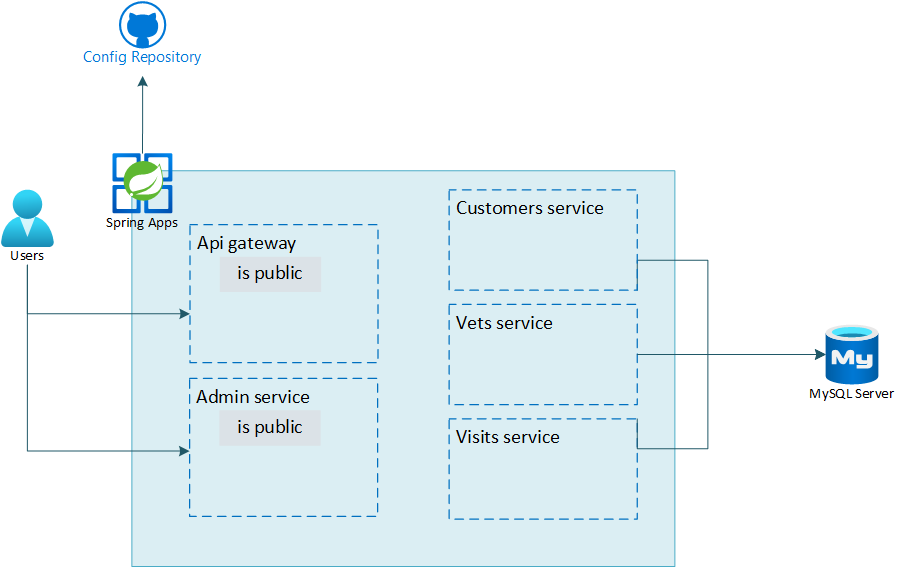

# Review

In this lab, you migrated your existing Spring Petclinic microservices application to Azure and
- Create an Azure Spring Apps service
- Set up the config repository
- Set up the config server for Azure Spring Apps
- Create an Azure MySQL Database service
- Deploy the Spring Petclinic app components to the Spring Apps service
- Provide publicly available endpoints for the Spring Petclinic application
- Test the application through the publicly available endpoints

The below image illustrates the end state you have build in this lab.

