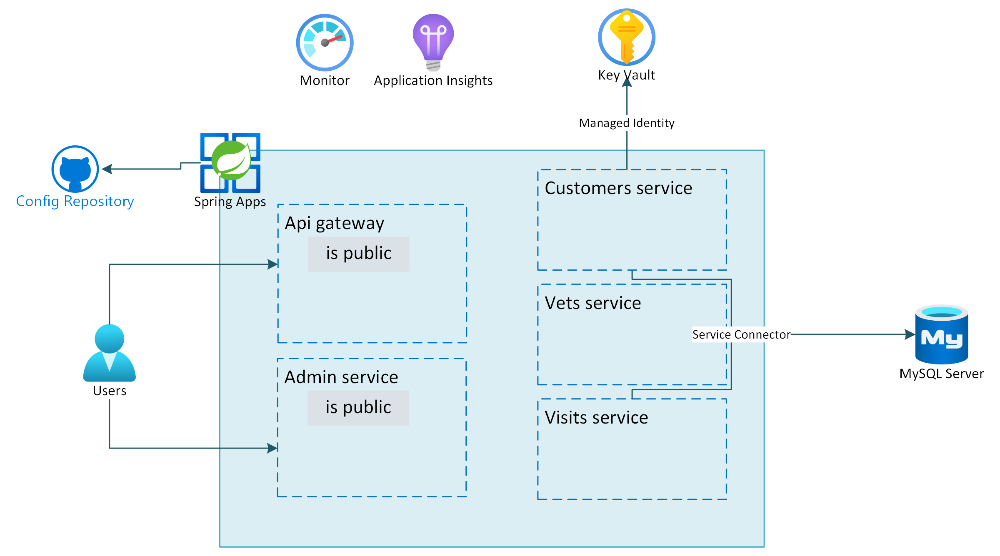

## Review
In this lab you implemented:
- Delete secrets from Key Vault
- Create an admin account for the MySQL Flexible Server
- Create service connections from the microservices to the database server
- Update the applications to use passwordless connectivity

The below image illustrates the end state you have build in this lab.

